# Email Screenshots

These are screenshots of received confirmation emails for completing hands-on Qwiklabs.

## Screenshots List

1. ### Examining Billing Data With BigQuery

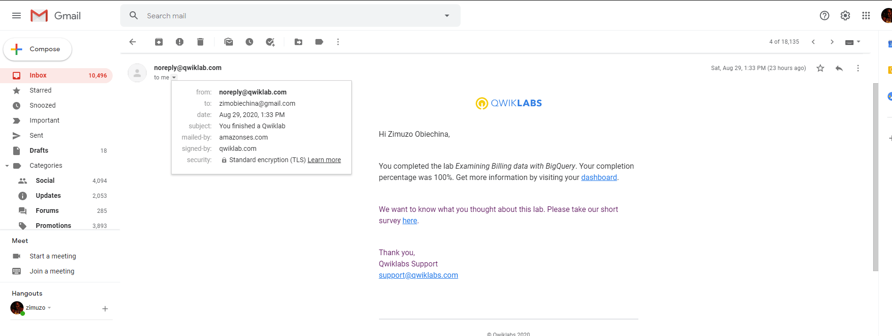

2. ### Cloud Storage

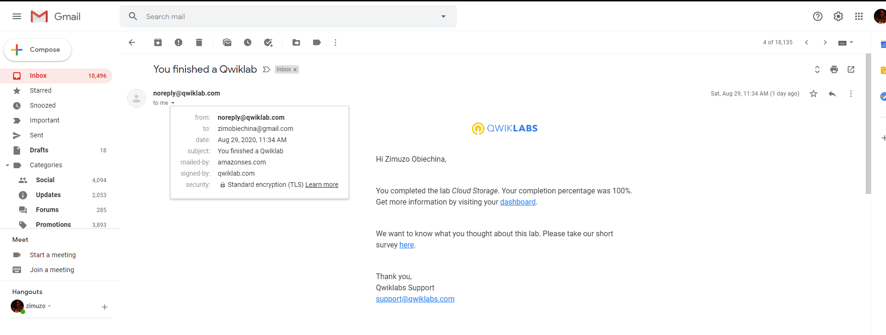

3. ### Resource Monitoring

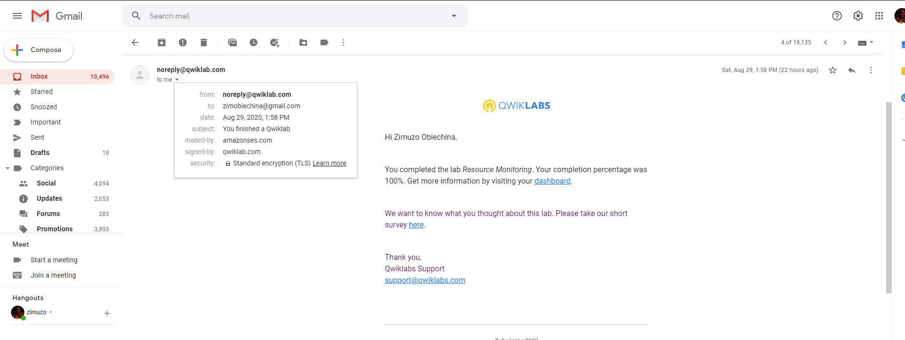

4. ### Virtual Private Networks(VPN)

 Lab")

5. ### Error Reporting and Debugging

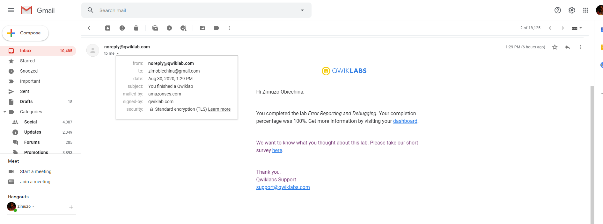

6. ### Automating the Deployment of Infrastructure Using Terraform

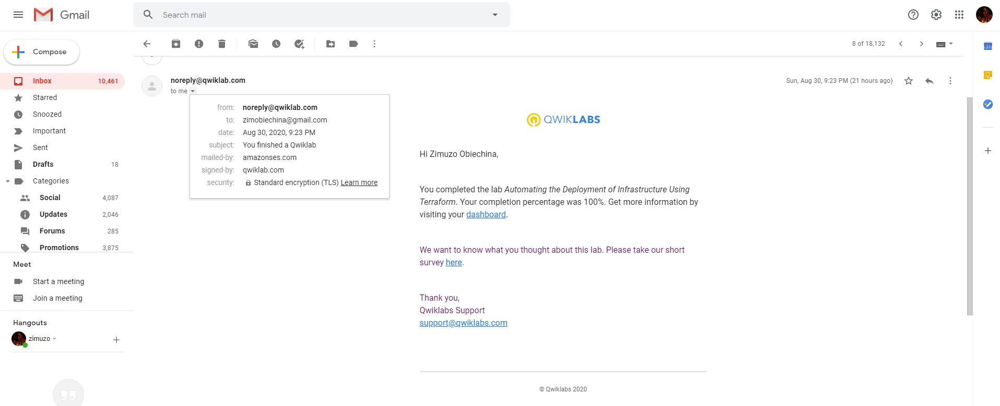

7. ### Automating the Deployment of Infrastructure Using Deployment Manager

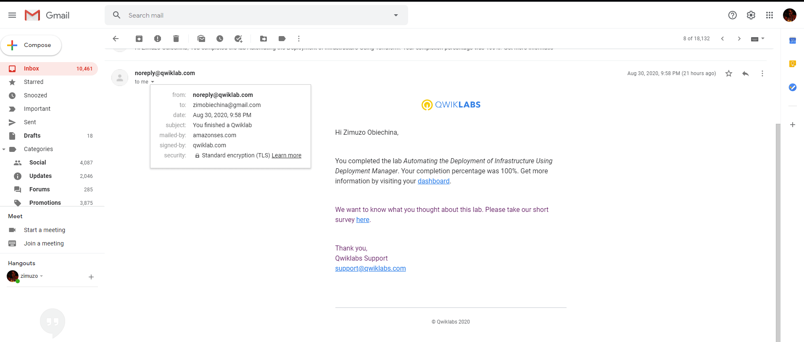

8. ### Implement Google Private Access and Cloud NAT

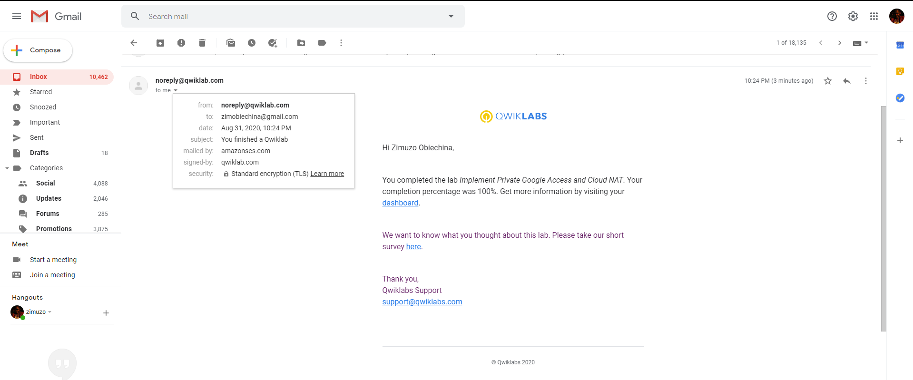

9. ### Working With Virtual Machines

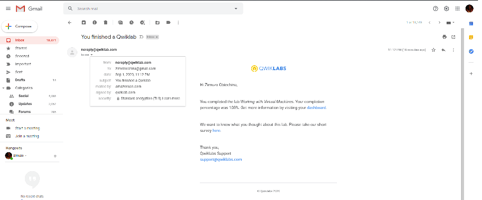

10. ### Implementing Cloud SQL

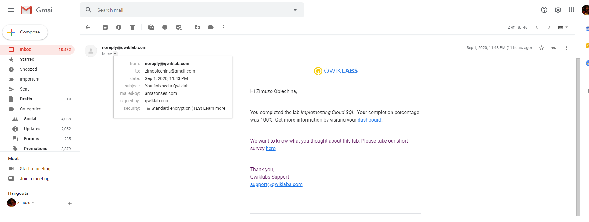

11. ### Google Cloud Fundamentals: Getting Started With App Engine

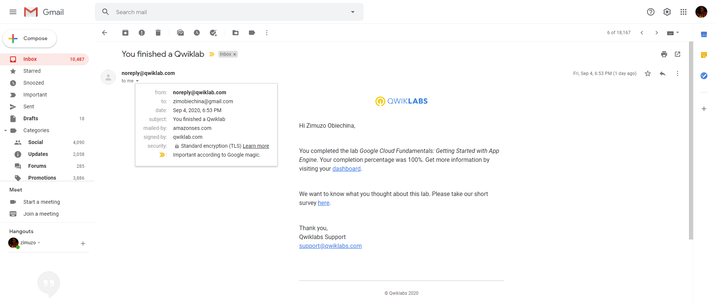

12. ### Google Cloud Fundamentals: Getting Started With GKE

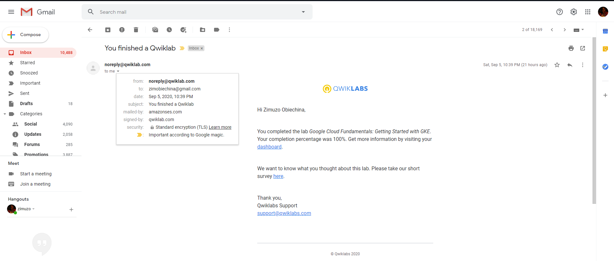

13. ### Google Cloud Fundamentals: Getting Started with Deployment Manager and Cloud Monitoring

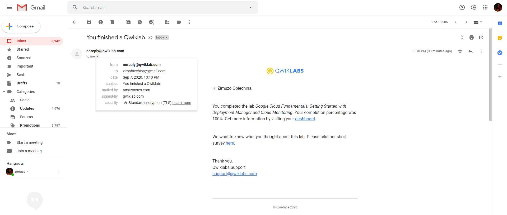

14. ### Google Cloud Fundamentals: Getting Started with BigQuery

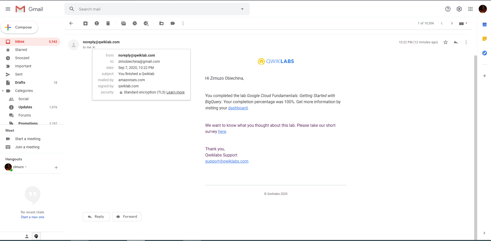

15. ### Console and Cloud Shell

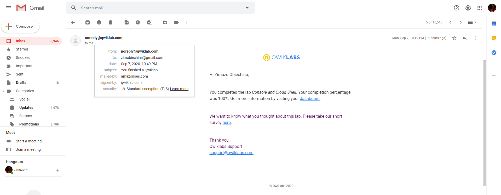