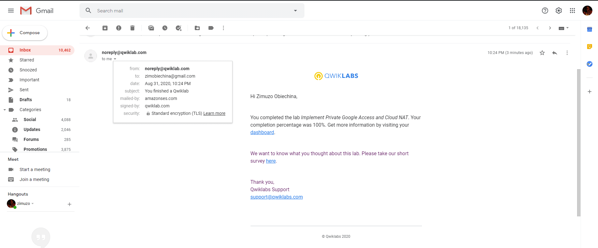
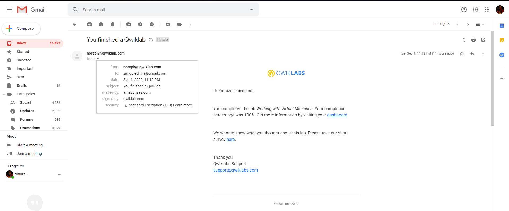

# Email Screenshots

These are screenshots of received confirmation emails for completing hands-on Qwiklabs.

## Screenshots List

1. ### Examining Billing Data With BigQuery

2. ### Cloud Storage

3. ### Resource Monitoring

4. ### Virtual Private Networks(VPN)

 Lab")

5. ### Error Reporting and Debugging

6. ### Automating the Deployment of Infrastructure Using Terraform

7. ### Automating the Deployment of Infrastructure Using Deployment Manager

8. ### Implement Google Private Access and Cloud NAT

9. ### Working With Virtual Machines

10. ### Implementing Cloud SQL

11. ### Google Cloud Fundamentals: Getting Started With App Engine

12. ### Google Cloud Fundamentals: Getting Started With GKE

13. ### Google Cloud Fundamentals: Getting Started with Deployment Manager and Cloud Monitoring

14. ### Google Cloud Fundamentals: Getting Started with BigQuery

15. ### Console and Cloud Shell

